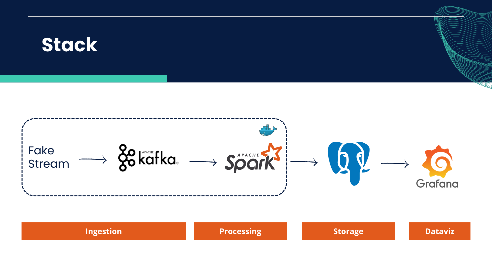

# Social Media Analysis

This project aims to analyze various events occurring on social media platforms such as (X, Instagram, Telegram, Facebook, Tiktok). In its development, the project utilizes streaming processing methods, where incoming data is generated by a fake stream for simulation.

## Project Stack

The project is built using the following:

- **Fake Stream Data:**
- | ID | Kota            | Sosial Media   | Jumlah User   | Total Penjualan (USD) | Timestamp (Unix)      |
|---|-----------------|----------------|---------------|------------------------|------------------------|
| 1 | Jakarta         | Instagram      | 1000          | 10000                  | 1642675200             |
| 2 | Bogor           | Facebook       | 1500          | 15500                  | 1642677000             |
| 3 | Depok           | Tiktok         | 800           | 8200                   | 1642678800             |
| 4 | Tangerang       | Telegram       | 1200          | 12800                  | 1642680600             |
| 5 | Bekasi          | Platform X      | 600           | 6500                   | 1642682400             |

- **Social Media Platforms:**
  - Platform X
  - Instagram
  - Telegram
  - Facebook
  - Tiktok

## Installation

Follow these steps to install the project:

1. Clone this repository to your local machine.
2. [Add installation steps if necessary]

## Usage

User guide for the project:

1. [Steps or commands to run the project]
2. [Instructions for using key features]

## Contribution

If you wish to contribute to this project, please follow the contribution guidelines.

## License

This project is licensed under [type of license]. See the [LICENSE.md](./LICENSE.md) file for more information.

## Contact

If you have any questions or would like to communicate about this project, please contact us at [email address or other communication platform].

Thank you for your interest in the Social Media Analysis project!
