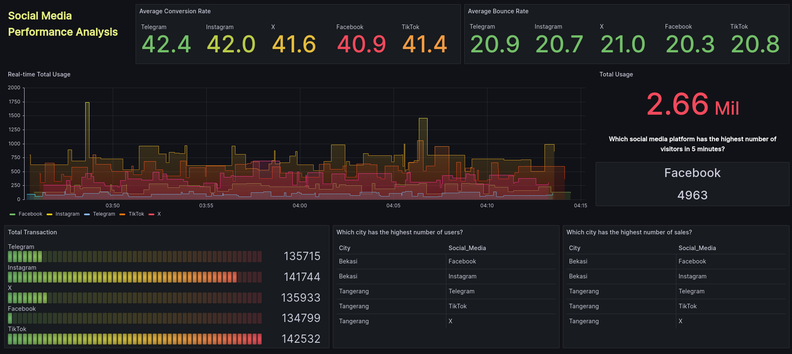

# Social Media Analysis

This project aims to analyze various events occurring on social media platforms such as (X, Instagram, Telegram, Facebook, Tiktok). In its development, the project utilizes streaming processing methods, where incoming data is generated by a fake stream for simulation.

## Project Stack

The project is built using the following:


### Fake Stream Data


| ID | City     | Social Media  | Usage Count | Sales | Visitors | Page Visitors | Conversion | Ts         |
|----|-----------|---------------|-------------|-------|----------|---------------|------------|------------|
| 1  | Jakarta   | Instagram     | 1000        | 10000 | 7500     | 6000          | 0.08       | 1642675200 |
| 2  | Bogor     | Facebook      | 1500        | 15500 | 12000    | 9000          | 0.10       | 1642677000 |
| 3  | Depok     | TikTok        | 800         | 8200  | 5000     | 4000          | 0.06       | 1642678800 |
| 4  | Tangerang | Telegram      | 1200        | 12800 | 9000     | 7500          | 0.09       | 1642680600 |
| 5  | Bekasi    | Platform X    | 600         | 6500  | 4000     | 3000          | 0.05       | 1642682400 |

here is the description for each column in the table:

- ID: Unique identification number for each row.
- City: Name of the city related to the data.
- Social Media: The social media platform used (Platform X, Instagram, Telegram, Facebook, and Tiktok)
- Usage Count: The number of times the social media platform was used or the related activity.
- Sales: The amount of sales related to the social media platform.
- Visitors: The number of visitors.
- Page Visitors: The number of page visitors.
- Conversion: The conversion rate, i.e., the ratio of sales to visitors.
- Ts: Timestamp in Unix format, indicating the time when the data was collected or recorded.

## Tools
### Kafka
- **Description:** Open-source streaming platform for real-time data processing.
- **Roles:**
    - **Producer:** Sends data to Kafka topics.
    - **Consumer:** Retrieves data from Kafka topics.
- **Key Use Cases:**
    - Real-time data transfer.
    - Distributed and reliable systems.

### PySpark
- **Description:** Python API for Apache Spark, enabling large-scale data processing and distributed analysis.
- **Roles:**
    - **Spark Driver:** Executes PySpark code and manages resources.
    - **Executor:** Runs data processing tasks in the Spark cluster.
- **Key Use Cases:**
    - Large-scale data processing.
    - Distributed data analysis and machine learning.

### PostgreSQL with Neon
- **Description:** PostgreSQL (RDBMS) with Neon, a Python library for interaction.
- **Roles:**
    - **PostgreSQL:** Stores and manages structured data.
    - **Neon:** Facilitates PySpark interaction.
- **Key Use Cases:**
    - Storage and management of structured data.
    - Integration between a database and data processing.

### Grafana
- **Description:** Visualization and monitoring platform supporting various data sources.
- **Role:**
    - **Dashboard:** Displays visualizations from different sources.
- **Key Use Cases:**
    - Monitoring system performance.
    - Creating interactive data analysis dashboards.

## Guide
1. Clone This Repo.
2. Run `make docker-build` for x86 user, or `make docker-build-arm` for arm chip user.

---
```
## docker-build			- Build Docker Images (amd64) including its inter-container network.
## docker-build-arm		- Build Docker Images (arm64) including its inter-container network.
## kafka  		        - Run a kafka container
## spark  		        - Run a Spark cluster, rebuild the postgres container, then create the destination tables
## spark-produce  		- Run a faker produce data to kafka
## spark-consume		- Run a code for listen kafka topic

```

---

## Example Output in Neon Postgre

| ID                                   | City       | Social Media | Usage Count | Sales | Visitors | Page Visitors | Conversion | Ts                  | Conversion Rate | Bounce Rate |
|--------------------------------------|-------------|--------------|-------------|-------|----------|---------------|------------|---------------------|-----------------|-------------|
| 1f295e09-a523-4055-84c4-06317adcdda9 | Bekasi      | TikTok       | 345         | 66    | 607      | 125           | 434        | 2024-02-03 11:33:58 | 71.50%          | 20.59%      |
| 6c077156-7bd4-4d46-a456-3ac2ebe7e309 | Bogor       | X            | 428         | 86    | 704      | 242           | 139        | 2024-02-03 11:32:17 | 19.74%          | 34.38%      |
| 0b16d5e5-4864-4ed0-81e5-1577f9b16e32 | Depok       | Telegram     | 62          | 140   | 870      | 202           | 212        | 2024-02-03 11:36:05 | 24.37%          | 23.22%      |
| fa9ecc5a-452c-498f-a9ab-a023ba7d9228 | Bogor       | TikTok       | 653         | 87    | 686      | 206           | 274        | 2024-02-03 11:32:04 | 39.94%          | 30.03%      |
| c905544b-06e2-4f79-a208-a4c4cc2053db | Tangerang   | Instagram    | 822         | 124   | 810      | 182           | 387        | 2024-02-03 11:33:49 | 47.78%          | 22.47%      |


## Data Visualization


[Grafana Dashboard Snapshot](https://farahduta7.grafana.net/dashboard/snapshot/qrIAmr58ReXo2wN8QHsJK3BeD8OVDDAJ)
